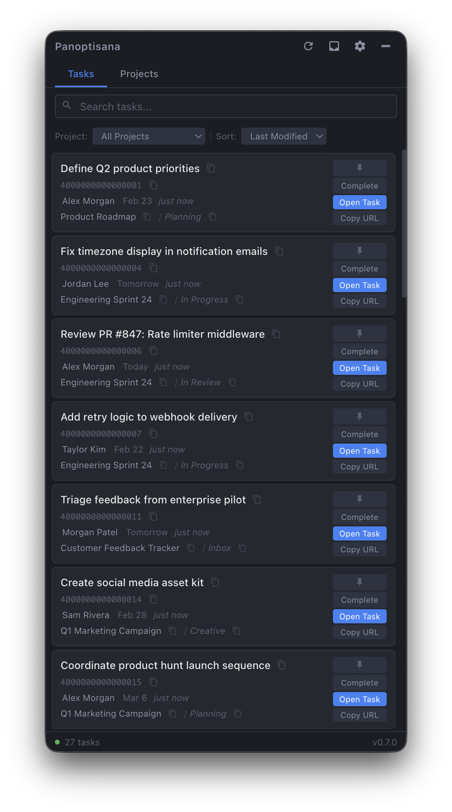
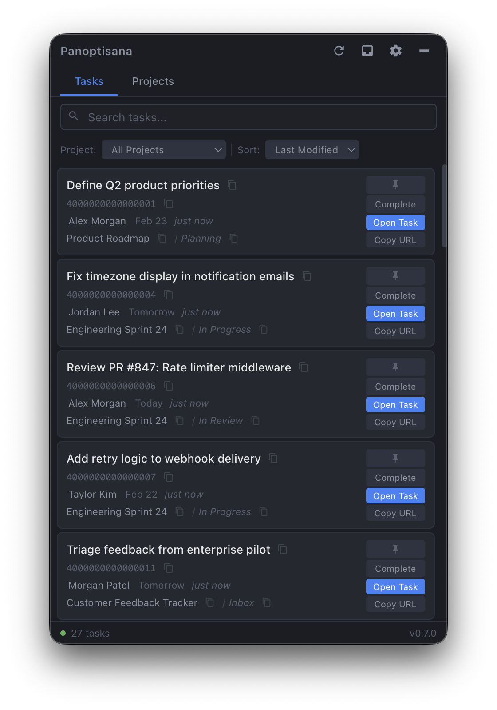
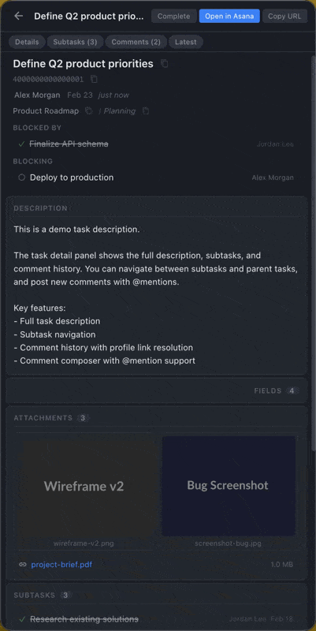
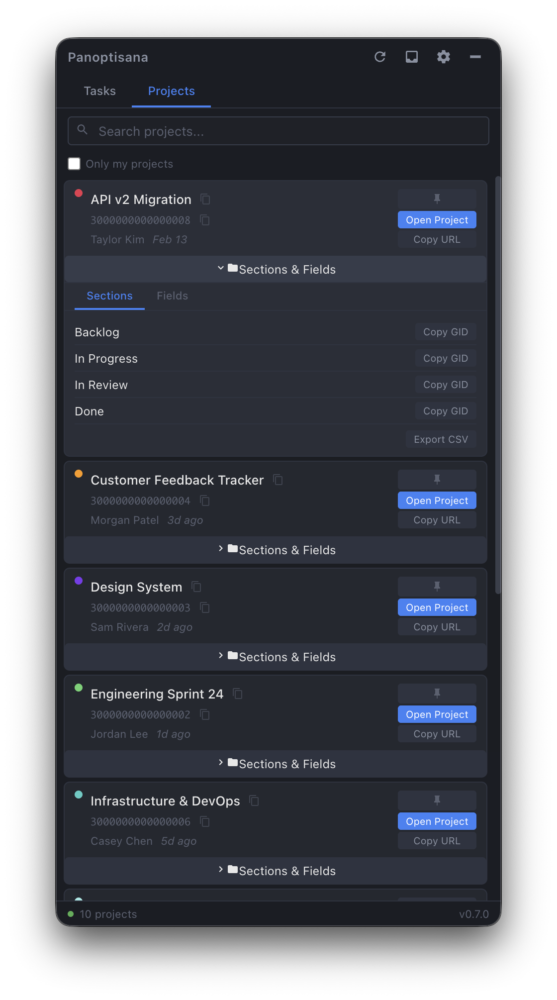
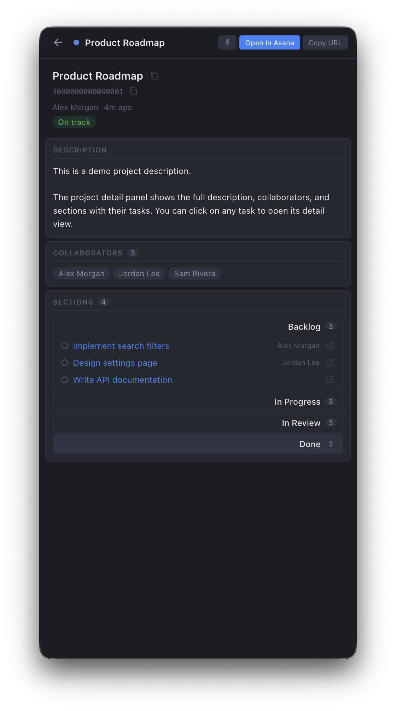
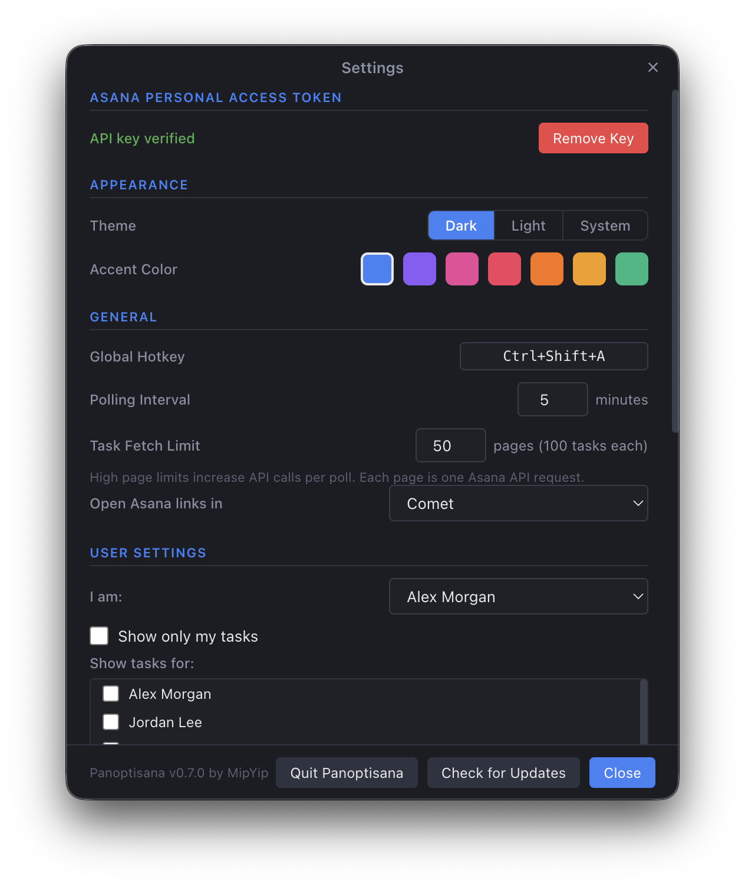

# Panoptisana

[](https://github.com/avanrossum/panoptisana/actions/workflows/ci.yml)

A fast, focused Asana visibility tool for macOS. Lives in your menu bar, shows your tasks and projects at a glance.

<p align="center">
  
</p>

## Why Panoptisana?

Asana's web app is built for project management. Panoptisana is built for project *visibility* -- a lightweight, always-accessible window that lets you scan your work without context-switching into a browser. It lives in your menu bar, stays on top of other windows, and shows you what matters: tasks, projects, activity, and details.

## Features

### Task List

Searchable, sortable list of all incomplete tasks. Filter by project, user, or name pattern. Pin important tasks to the top. Complete tasks directly from the list. Activity highlighting marks tasks with new changes since you last looked.

<p align="center">
  
</p>

### Task Detail Panel

Click any task to open a full detail view with description, attachments, dependencies, subtasks, custom fields, and the complete comment history. Post comments with @mention autocomplete. Navigate into subtasks and back.

<p align="center">
  
</p>

### Project List

All active projects with owner, last modified time, and color-coded dots. Expand any project to view and copy section GIDs and custom field GIDs -- useful for automation workflows and API scripting. Export sections and fields to CSV.

<p align="center">
  
</p>

### Project Detail Panel

Click any project to see its full description, collaborators, status, and all sections with their tasks. Click a task to drill into its detail view.

<p align="center">
  
</p>

### Inbox Notifications

Slide-out drawer showing recent activity on your assigned tasks -- comments, assignments, status changes, and more. Keyboard shortcut: Cmd+I.

### Settings

Dark, light, or system theme with 7 accent colors. Configurable polling interval, task fetch depth, global hotkey, browser selection, user filtering, and exclusion/inclusion lists.

<p align="center">
  
</p>

### Full Feature List

- **Task & Project Lists** -- Searchable, sortable, filterable
- **Task Detail Panel** -- Description, subtasks, dependencies, attachments, custom fields, comments
- **Project Detail Panel** -- Description, collaborators, status, sections with tasks
- **Comment Composer** -- Post comments with @mention autocomplete and profile link resolution
- **Inbox Notifications** -- Slide-out drawer with recent activity on assigned tasks
- **Activity Highlighting** -- Gold border on tasks with new changes
- **Pinning** -- Pin tasks or projects to the top of the list
- **Smart Filtering** -- Exclude/include by name pattern, filter by user or project
- **GID Surfacing** -- Copy task, project, section, and field GIDs for automation
- **CSV Export** -- Export section and field data from projects
- **Right-Click Context Menu** -- Exclude, pin, copy GID/URL
- **Dark/Light/System Theme** -- 7 accent colors
- **Global Hotkey** -- Ctrl+Shift+A to toggle visibility (configurable)
- **Browser Selection** -- Open Asana links in Safari, Chrome, Firefox, Arc, Zen, Comet, or the Asana desktop app
- **Auto-Updates** -- Automatic update checks via GitHub releases
- **Encrypted API Key** -- Stored via macOS Keychain (Electron safeStorage)

## Getting Started

### Prerequisites

- macOS 12 or later
- An Asana account with a [Personal Access Token](https://app.asana.com/0/my-apps)

### Install from Release

Download the latest `.dmg` from the [Releases](https://github.com/avanrossum/panoptisana/releases) page.

### Build from Source

```bash
git clone https://github.com/avanrossum/panoptisana.git
cd panoptisana
npm install
npm run dev
```

### Getting an Asana Personal Access Token

Panoptisana needs a Personal Access Token (PAT) -- not an app client secret. To create one:

1. Go to the [Asana Developer Console](https://app.asana.com/0/my-apps)
2. Under **Personal access tokens**, click **Create new token**
3. Give it a name (e.g. "Panoptisana") and click **Create token**
4. Copy the token (it starts with `1/`) -- you won't be able to see it again

The token is stored encrypted on your machine and is never sent anywhere except directly to Asana's API.

### Setup

1. Launch Panoptisana (it appears as a menu bar icon)
2. Click the gear icon or right-click the tray icon to open Settings
3. Paste your Personal Access Token and click **Verify**
4. Select yourself from the "I am" dropdown
5. Optionally check "Show only my tasks" or select specific users

## Development

```bash
npm run dev          # Dev mode (Vite HMR + Electron)
npm run build        # Production build
npm run pack         # Package without signing
npm run typecheck    # Type-check both main and renderer tsconfigs
npm run lint         # ESLint
npm test             # Run tests
npm run test:watch   # Tests in watch mode
```

## Architecture

Panoptisana is an Electron app with a React renderer. The main process handles Asana API polling, SQLite persistence, and OS integration. The renderer handles all UI and client-side filtering.

- **Main process**: TypeScript compiled to CommonJS via `tsc`
- **Renderer**: TypeScript + React compiled via Vite
- **Storage**: SQLite (better-sqlite3) with WAL mode
- **IPC**: Typed channels with namespace conventions (`store:*`, `asana:*`, `app:*`, etc.)
- **Testing**: Pure logic extracted to `src/shared/`, tested with Vitest

See [ROADMAP.md](ROADMAP.md) for planned features and [CHANGELOG.md](CHANGELOG.md) for version history.

## Development Methodology

Panoptisana is built using AI-assisted development with structured engineering practices. Every feature follows a full software development lifecycle: requirements are captured in a living roadmap, architecture decisions and lessons learned are documented in session context files, and a shared set of design standards (coding conventions, style guides, and testing standards) governs consistency across projects. AI tooling accelerates implementation, but the engineering rigor is human-driven: clear specifications, incremental commits, extracted and tested pure logic, CI/CD gates (lint + test on every push), and a release script that enforces quality checks before any build ships. The methodology treats AI as a collaborator operating within well-defined constraints, not as an autonomous agent -- the standards, architecture documentation, and accumulated project memory are what make AI-assisted development effective at scale.

## Known Limitations

- **Single workspace only** -- Panoptisana uses the first workspace returned by the Asana API. Multi-workspace support is on the [roadmap](ROADMAP.md).
- **macOS only** -- Built and tested on macOS. Linux/Windows support is not currently planned.

## Tech Stack

| Component | Technology |
|-----------|------------|
| Framework | Electron 40 |
| UI | React 19 |
| Language | TypeScript (strict mode) |
| Build | Vite 7 |
| Storage | SQLite (better-sqlite3) |
| Testing | Vitest |
| CI | GitHub Actions |
| Auto-update | electron-updater |

## License

This project is licensed under the **GNU General Public License v3.0** -- see the [LICENSE](LICENSE) file for details.

**Pre-v1 (current):** All features, including auto-updates and signed DMG releases, are included in the open-source distribution. Everything ships as-is under GPL-3.0.

**v1 and beyond:** If and when Panoptisana reaches v1, distribution may move to a split model -- the core application remains open-source under GPL-3.0, while signed binaries, auto-updates, and managed distribution may be offered separately as a one-time purchase. The source code will always be available to build from. This is not a commitment to change the model -- just a reservation of the option.

## Credits

Built by [MipYip](https://github.com/avanrossum).
